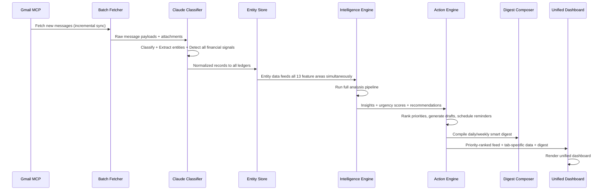

Here's the complete updated design doc. Copy-paste the whole thing into your `design.md`:

---

```markdown
# Design Document: Inbox Intelligence — Smart Financial Assistant

## Overview

Inbox Intelligence is a Gmail-native AI financial assistant that transforms unstructured email into actionable financial intelligence. It is a single unified tool — not a collection of separate modules — that scans your inbox to detect subscriptions, score usage, surface savings opportunities, track financial commitments, monitor contracts, predict spending patterns, and deliver a daily smart digest.

The tool operates through one ingestion pipeline, one analysis engine, and one unified dashboard. Thirteen feature capabilities provide different analytical lenses on the same underlying data — all within a single product, one entry point, one dashboard.

The architecture follows a three-layer design: a Gmail ingestion layer pulls and parses messages; a unified analysis pipeline powered by Claude classifies, extracts entities, and runs financial intelligence computations; and a single React dashboard surfaces prioritized insights with one-click actions (cancel drafts, negotiation emails, follow-up messages, calendar reminders, smart digest).

---

## Core Design Principle: One Tool, Many Lenses

This is NOT a multi-module platform. It is a single financial intelligence assistant with multiple analytical capabilities applied to the same data:

| Feature Area | What It Answers |
|---|---|
| Subscription & Spend Scanner | Where is my money going? What am I paying for? Active vs dead subscriptions? |
| Subscription Usage Scoring | Am I actually using what I pay for? What's zombie spend? |
| Smart Savings & Negotiation Engine | What duplicates can I cut? Can I negotiate a better price? |
| Free Trial Expiry Tracker | What trials are about to convert to paid? |
| Annual vs Monthly Optimizer | Am I overpaying by staying on monthly billing? |
| Subscription Creep Alert | Is my total recurring spend growing without me noticing? |
| Refund & Credit Tracker | Did I actually receive the refund I was promised? |
| Payment Promise Tracker | Who promised to pay me and hasn't? |
| Renewal & Deadline Reminders | What's about to charge me? When do I need to act? |
| Spend Pattern Analysis & Insights | How is my spending changing over time? Where does most money go? |
| Follow-Up & Commitment Tracker | What financial promises are outstanding? |
| Financial Obligations & Contract Watch | What contracts bind me? What penalties am I exposed to? |
| Smart Digest | One daily/weekly summary of everything that matters financially |

All features share the same entity store, the same ingestion pipeline, and the same action engine. A subscription detected by the Scanner feeds into Usage Scoring, triggers Savings Recommendations, contributes to Spend Pattern Analysis, and appears in the Smart Digest simultaneously.

---

## Architecture

### System Overview

```mermaid
graph TD
    subgraph "Layer 1: Ingestion"
        GM[Gmail MCP Connector]
        GC[Google Calendar MCP]
        AP[Attachment Parser - PDFs, Receipts]
        BF[Batch Fetcher + Incremental Sync]
        US[Usage Signal Collector]
    end

    subgraph "Layer 2: Unified Analysis Pipeline"
        CC[Claude Classifier & Entity Extractor]
        DE[Deduplication Engine]
        TI[Temporal Indexer]
        ES[(Entity Store - SQLite/PostgreSQL)]
        SL[(Subscription Ledger)]
        CL[(Commitment Ledger)]
        OL[(Obligation Ledger)]
        PH[(Payment History)]
        FT[(Free Trial Registry)]
        RT[(Refund Tracker)]
    end

    subgraph "Layer 3: Intelligence Engine"
        SS[Subscription & Spend Scanner]
        USR[Usage Scorer]
        SR[Smart Savings & Negotiation Engine]
        FTE[Free Trial Expiry Tracker]
        AMO[Annual vs Monthly Optimizer]
        SCA[Subscription Creep Alerter]
        RCT[Refund & Credit Tracker]
        PPT[Payment Promise Tracker]
        RR[Renewal & Deadline Reminders]
        SP[Spend Pattern Analyzer]
        FCT[Financial Commitment Tracker]
        CW[Contract & Obligation Watcher]
        SD[Smart Digest Generator]
    end

    subgraph "Action Engine"
        PR[Priority Ranker]
        DG[Draft Generator - Cancel/Negotiate/Follow-up]
        CA[Calendar Alert Scheduler]
        NE[Notification Engine]
        DI[Digest Composer]
    end

    subgraph "Frontend: Unified Dashboard"
        DB[React + Tailwind Dashboard]
        OV[Overview Tab - Priority Feed + Digest]
        ST[Subscriptions Tab - Scanner + Usage + Trials]
        SV[Savings Tab - Recommendations + Optimizer]
        RT2[Reminders Tab - Renewals + Deadlines]
        PT[Patterns Tab - Trends + Creep Alerts]
        CT[Commitments Tab - Promises + Refunds]
        OT[Obligations Tab - Contracts + Risk]
    end

    GM --> BF
    BF --> AP
    AP --> CC
    US --> CC
    CC --> DE
    DE --> TI
    TI --> ES
    TI --> SL
    TI --> CL
    TI --> OL
    TI --> PH
    TI --> FT
    TI --> RT

    ES --> SS
    SL --> SS
    SL --> USR
    SL --> SR
    SL --> FTE
    SL --> AMO
    SL --> SCA
    PH --> SP
    SL --> SP
    RT --> RCT
    CL --> PPT
    CL --> FCT
    OL --> CW
    SL --> RR
    ES --> CW

    SS --> PR
    USR --> PR
    SR --> PR
    FTE --> PR
    AMO --> PR
    SCA --> PR
    RCT --> PR
    PPT --> PR
    RR --> PR
    SP --> PR
    FCT --> PR
    CW --> PR

    PR --> SD
    PR --> DG
    PR --> CA
    PR --> NE
    PR --> DB
    SD --> DI
    DI --> DB

    OV --> DB
    ST --> DB
    SV --> DB
    RT2 --> DB
    PT --> DB
    CT --> DB
    OT --> DB
```



### Data Flow Sequence



---

## Components and Interfaces

### Component 1: Gmail MCP Connector

**Purpose**: Authenticates with Gmail API and fetches message batches with pagination, rate limiting, and incremental sync.

**Interface**:
```typescript
interface GmailMCPConnector {
  authenticate(credentials: OAuthCredentials): Promise<AuthToken>;
  fetchMessages(options: FetchOptions): Promise<RawMessage[]>;
  fetchThread(threadId: string): Promise<RawThread>;
  fetchAttachment(messageId: string, attachmentId: string): Promise<Attachment>;
  getHistoryId(): Promise<string>;
  incrementalSync(lastHistoryId: string): Promise<RawMessage[]>;
}

interface FetchOptions {
  since: Date;
  maxResults: number;
  labelIds?: string[];
  query?: string;
  pageToken?: string;
}
```

**Responsibilities**:
- OAuth2 authentication and token refresh
- Batch message fetching with pagination
- Incremental sync via historyId (only fetch new messages)
- Rate limiting (Gmail API quota: 250 units/second)
- Attachment downloading and parsing (receipts, invoices, contracts)

---

### Component 2: Usage Signal Collector

**Purpose**: Collects engagement signals from vendor emails to determine whether the user is actively using a subscription.

**Interface**:
```typescript
interface UsageSignalCollector {
  collectSignals(vendor: string, messages: AnalyzedMessage[]): UsageProfile;
  computeUsageScore(profile: UsageProfile): number;  // 0-10
  detectZombieSubscriptions(subscriptions: SubscriptionRecord[]): ZombieSubscription[];
}

interface UsageProfile {
  vendor: string;
  totalEmailsFromVendor: number;
  emailsOpened: number;           // Inferred from reply/forward activity
  lastInteractionDate: Date;
  interactionTypes: InteractionType[];
  loginAlerts: number;            // "New login from..." emails
  usageReports: number;           // Weekly/monthly usage summary emails
  featureAnnouncements: number;   // Product update emails
  engagementDecayRate: number;    // How fast engagement is dropping
}

type InteractionType = "login_alert" | "usage_report" | "receipt" | "feature_update" | "support_ticket" | "newsletter_open";

interface ZombieSubscription {
  subscription: SubscriptionRecord;
  usageScore: number;
  lastEngagementDate: Date;
  daysSinceLastEngagement: number;
  monthlyWaste: number;
  annualWaste: number;
  recommendation: string;
}
```

---

### Component 3: Claude Unified Classifier

**Purpose**: Single Claude prompt chain that classifies every message, extracts all financial entities, detects commitments, identifies subscription signals, flags contract terms, detects trial expiry notices, refund confirmations, and payment promises — all in one pass.

**Interface**:
```typescript
interface ClaudeUnifiedClassifier {
  analyzeMessage(message: ParsedMessage): Promise<AnalyzedMessage>;
  analyzeBatch(messages: ParsedMessage[]): Promise<AnalyzedMessage[]>;
}

interface AnalyzedMessage {
  messageId: string;
  threadId: string;
  timestamp: Date;
  sender: string;
  senderDomain: string;
  classifications: FinancialSignalType[];
  subscriptionSignal: SubscriptionSignal | null;
  commitmentSignals: CommitmentSignal[];
  contractSignal: ContractSignal | null;
  refundSignal: RefundSignal | null;
  trialSignal: TrialSignal | null;
  financialEntities: FinancialEntity[];
  usageIndicators: UsageIndicator[];
  urgencyScore: number;  // 0-10
  summary: string;
}

type FinancialSignalType =
  | "subscription_receipt"
  | "subscription_confirmation"
  | "renewal_notice"
  | "price_change"
  | "cancellation_confirmation"
  | "invoice"
  | "payment_reminder"
  | "contract_terms"
  | "financial_commitment"
  | "refund_notice"
  | "refund_promise"
  | "credit_applied"
  | "demand_letter"
  | "auto_renewal_notice"
  | "trial_expiry"
  | "trial_started"
  | "payment_promise"
  | "payment_received"
  | "annual_plan_offer"
  | "login_alert"
  | "usage_report"
  | "noise";

interface SubscriptionSignal {
  vendor: string;
  vendorDomain: string;
  amount: number;
  currency: string;
  billingFrequency: BillingFrequency;
  category: SubscriptionCategory;
  renewalDate: Date | null;
  isActive: boolean;
  isPriceChange: boolean;
  previousAmount?: number;
  autoRenews: boolean;
  trialEndsDate?: Date;
  annualPlanAvailable?: boolean;
  annualPlanAmount?: number;
}

interface RefundSignal {
  vendor: string;
  amount: number;
  currency: string;
  status: "promised" | "confirmed" | "processed" | "failed";
  expectedDate: Date | null;
  originalTransactionDate: Date | null;
  reason: string;
}

interface TrialSignal {
  vendor: string;
  trialStartDate: Date;
  trialEndDate: Date;
  convertsToAmount: number | null;
  convertsToFrequency: BillingFrequency | null;
  autoConverts: boolean;
  cancellationUrl?: string;
}

interface CommitmentSignal {
  type: "outbound" | "inbound";
  subtype: "payment_promise" | "refund_promise" | "invoice_promise" | "general_financial" | "non_financial";
  description: string;
  owner: string;
  counterparty: string;
  dueDate: Date | null;
  financialValue: number | null;
  isImplicit: boolean;
  confidence: number;  // 0-1
}

interface ContractSignal {
  contractType: "subscription_tos" | "lease" | "service_agreement" | "loan" | "insurance" | "other";
  parties: string[];
  totalValue: number | null;
  renewalDate: Date | null;
  autoRenews: boolean;
  penaltyClauses: string[];
  noticeWindowDays: number | null;
  financialExposure: number;
  priceEscalationClause: boolean;
}

type UsageIndicator = "login_alert" | "usage_report" | "feature_update" | "support_interaction" | "newsletter_engagement";
```

---

### Component 4: Unified Entity Store

**Purpose**: Single persistent store for all financial intelligence data. All feature areas read from this store.

**Interface**:
```typescript
interface UnifiedEntityStore {
  // Core message records
  insertMessage(record: AnalyzedMessage): Promise<void>;
  getMessage(messageId: string): Promise<AnalyzedMessage | null>;
  queryMessages(filter: MessageFilter): Promise<AnalyzedMessage[]>;

  // Subscription Ledger
  upsertSubscription(sub: SubscriptionRecord): Promise<void>;
  getSubscriptions(filter?: SubscriptionFilter): Promise<SubscriptionRecord[]>;
  getSubscriptionsByCategory(category: SubscriptionCategory): Promise<SubscriptionRecord[]>;
  getActiveSubscriptions(): Promise<SubscriptionRecord[]>;
  getZombieSubscriptions(): Promise<SubscriptionRecord[]>;
  getSubscriptionHistory(vendor: string): Promise<PaymentRecord[]>;

  // Free Trial Registry
  insertTrial(trial: TrialRecord): Promise<void>;
  getActiveTrials(): Promise<TrialRecord[]>;
  getExpiringTrials(daysAhead: number): Promise<TrialRecord[]>;

  // Refund Tracker
  insertRefund(refund: RefundRecord): Promise<void>;
  getPendingRefunds(): Promise<RefundRecord[]>;
  getOverdueRefunds(): Promise<RefundRecord[]>;
  markRefundReceived(refundId: string): Promise<void>;

  // Commitment Ledger
  insertCommitment(commitment: FinancialCommitment): Promise<void>;
  updateCommitmentStatus(id: string, status: CommitmentStatus): Promise<void>;
  getOpenCommitments(): Promise<FinancialCommitment[]>;
  getOverdueCommitments(): Promise<FinancialCommitment[]>;
  getPaymentPromises(): Promise<FinancialCommitment[]>;

  // Obligation Ledger
  upsertObligation(obligation: FinancialObligation): Promise<void>;
  getObligations(filter?: ObligationFilter): Promise<FinancialObligation[]>;
  getUpcomingDeadlines(daysAhead: number): Promise<ObligationDeadline[]>;

  // Payment History (for pattern analysis)
  insertPayment(payment: PaymentRecord): Promise<void>;
  getPaymentHistory(range: DateRange): Promise<PaymentRecord[]>;
  getMonthlySpendSummary(months: number): Promise<MonthlySpend[]>;
  getSpendByCategory(range: DateRange): Promise<CategorySpend[]>;
  getTotalRecurringSpend(): Promise<RecurringSpendSnapshot[]>;

  // Cross-cutting queries
  getFinancialCalendar(range: DateRange): Promise<CalendarEntry[]>;
  searchByVendor(vendor: string): Promise<VendorProfile>;
  getDigestData(period: "daily" | "weekly"): Promise<DigestData>;
}
```

---

### Component 5: Intelligence Engine

**Purpose**: Orchestrates all feature areas against the shared entity store. Each feature area is a function, not a separate module.

```typescript
interface IntelligenceEngine {
  // Feature 1: Subscription & Spend Scanner
  scanSubscriptions(): Promise<SubscriptionScanResult>;

  // Feature 2: Subscription Usage Scoring
  scoreSubscriptionUsage(): Promise<UsageScoringResult>;

  // Feature 3: Smart Savings & Negotiation Engine
  generateSavingsRecommendations(): Promise<SavingsResult>;
  generateNegotiationOpportunities(): Promise<NegotiationOpportunity[]>;

  // Feature 4: Free Trial Expiry Tracker
  trackTrialExpiries(): Promise<TrialExpiryResult>;

  // Feature 5: Annual vs Monthly Optimizer
  findBillingOptimizations(): Promise<BillingOptimization[]>;

  // Feature 6: Subscription Creep Alert
  detectSubscriptionCreep(): Promise<CreepAlert | null>;

  // Feature 7: Refund & Credit Tracker
  trackRefundsAndCredits(): Promise<RefundTrackingResult>;

  // Feature 8: Payment Promise Tracker
  trackPaymentPromises(): Promise<PaymentPromiseResult>;

  // Feature 9: Renewal & Deadline Reminders
  computeUpcomingRenewals(leadTimeDays: number[]): Promise<RenewalAlert[]>;

  // Feature 10: Spend Pattern Analysis
  analyzeSpendingPatterns(): Promise<SpendAnalysis>;

  // Feature 11: Follow-Up & Commitment Tracker
  trackFinancialCommitments(): Promise<CommitmentTrackingResult>;

  // Feature 12: Financial Obligations & Contract Watch
  watchObligations(): Promise<ObligationWatchResult>;

  // Feature 13: Smart Digest
  generateDigest(period: "daily" | "weekly"): Promise<SmartDigest>;

  // Unified priority feed
  getPriorityFeed(limit: number): Promise<PrioritizedItem[]>;
}
```

---

### Component 6: Action Engine

**Purpose**: Executes actions across all feature areas — draft generation, calendar scheduling, notifications, digest delivery.

```typescript
interface ActionEngine {
  // Drafts
  generateCancellationDraft(subscription: SubscriptionRecord): Promise<EmailDraft>;
  generateFollowUpDraft(commitment: FinancialCommitment): Promise<EmailDraft>;
  generateNegotiationDraft(subscription: SubscriptionRecord, reason: NegotiationReason): Promise<EmailDraft>;
  generateRefundFollowUpDraft(refund: RefundRecord): Promise<EmailDraft>;
  generateTrialCancellationDraft(trial: TrialRecord): Promise<EmailDraft>;

  // Calendar
  scheduleReminder(alert: RenewalAlert): Promise<CalendarEvent>;
  scheduleTrialExpiryReminder(trial: TrialRecord, leadDays: number[]): Promise<CalendarEvent>;
  scheduleBatchReminders(alerts: RenewalAlert[]): Promise<ReminderScheduleResult>;

  // Notifications
  dispatchNotification(item: PrioritizedItem): Promise<void>;
  dispatchCreepAlert(alert: CreepAlert): Promise<void>;

  // Digest
  composeDigest(data: DigestData): Promise<SmartDigest>;
  deliverDigest(digest: SmartDigest, channel: "email" | "dashboard" | "both"): Promise<void>;
}

type NegotiationReason = "price_increase" | "competitor_cheaper" | "long_tenure_discount" | "usage_low";
```

---

### Component 7: Unified Dashboard API

**Purpose**: Single API serving all dashboard tabs from the same backend.

```typescript
interface DashboardAPI {
  // Global
  getPriorityFeed(limit: number): Promise<PrioritizedItem[]>;
  getFinancialCalendar(range: DateRange): Promise<CalendarEntry[]>;
  getSmartDigest(period: "daily" | "weekly"): Promise<SmartDigest>;
  dismissItem(itemId: string): Promise<void>;

  // Tab: Subscriptions (Scanner + Usage + Trials)
  getSubscriptionOverview(): Promise<SubscriptionOverviewData>;
  getUsageScores(): Promise<UsageScoringResult>;
  getActiveTrials(): Promise<TrialRecord[]>;
  getZombieSubscriptions(): Promise<ZombieSubscription[]>;

  // Tab: Savings (Recommendations + Optimizer + Negotiation)
  getSavingsRecommendations(): Promise<SavingsRecommendation[]>;
  getBillingOptimizations(): Promise<BillingOptimization[]>;
  getNegotiationOpportunities(): Promise<NegotiationOpportunity[]>;
  getTotalPotentialSavings(): Promise<SavingsSummary>;

  // Tab: Reminders (Renewals + Deadlines + Trial Expiries)
  getUpcomingRenewals(): Promise<RenewalAlert[]>;
  getExpiringTrials(): Promise<TrialRecord[]>;
  configureLeadTime(vendor: string, days: number[]): Promise<void>;

  // Tab: Patterns (Trends + Creep Alerts)
  getSpendPatterns(): Promise<SpendAnalysis>;
  getMonthOverMonthComparison(): Promise<MoMComparison>;
  getSubscriptionCreepData(): Promise<CreepAlert | null>;
  getRecurringSpendTimeline(): Promise<RecurringSpendSnapshot[]>;

  // Tab: Commitments (Promises + Refunds)
  getFinancialCommitments(): Promise<CommitmentTrackingResult>;
  getPaymentPromises(): Promise<PaymentPromiseResult>;
  getPendingRefunds(): Promise<RefundTrackingResult>;

  // Tab: Obligations (Contracts + Risk)
  getObligationWatch(): Promise<ObligationWatchResult>;

  // Actions
  approveDraft(draftId: string): Promise<void>;
  requestDraft(type: DraftType, targetId: string): Promise<EmailDraft>;
  markRefundReceived(refundId: string): Promise<void>;
  acknowledgeCreepAlert(alertId: string): Promise<void>;
}
```

---

## Data Models

### SubscriptionRecord

```typescript
interface SubscriptionRecord {
  id: string;
  vendor: string;
  vendorDomain: string;
  amount: number;
  currency: string;
  billingFrequency: BillingFrequency;
  category: SubscriptionCategory;
  status: SubscriptionStatus;
  usageScore: number;            // 0-10 (from Usage Scoring)
  wasteScore: number;            // 0-10
  firstSeenDate: Date;
  lastPaymentDate: Date;
  nextRenewalDate: Date | null;
  autoRenews: boolean;
  trialEndsDate: Date | null;
  annualPlanAvailable: boolean;
  annualPlanAmount: number | null;
  annualSavingsIfSwitched: number | null;
  priceChangeHistory: PriceChange[];
  sourceMessageIds: string[];
  createdAt: Date;
  updatedAt: Date;
}

type BillingFrequency = "weekly" | "monthly" | "quarterly" | "semi-annual" | "annual" | "one-time";

type SubscriptionCategory =
  | "music-streaming"
  | "video-streaming"
  | "productivity"
  | "cloud-storage"
  | "fitness"
  | "news-media"
  | "software-saas"
  | "security-vpn"
  | "food-delivery"
  | "gaming"
  | "education"
  | "utilities"
  | "insurance"
  | "other";

type SubscriptionStatus =
  | "active-used"
  | "active-unused"
  | "zombie"             // Paying but zero engagement
  | "price-increased"
  | "renewing-soon"
  | "trial-active"
  | "cancelled"
  | "unknown";

interface PriceChange {
  previousAmount: number;
  newAmount: number;
  detectedDate: Date;
  percentageChange: number;
  sourceMessageId: string;
}
```

### TrialRecord

```typescript
interface TrialRecord {
  id: string;
  vendor: string;
  vendorDomain: string;
  category: SubscriptionCategory;
  trialStartDate: Date;
  trialEndDate: Date;
  daysRemaining: number;
  convertsToAmount: number | null;
  convertsToFrequency: BillingFrequency | null;
  autoConverts: boolean;
  cancellationUrl: string | null;
  status: "active" | "expiring_soon" | "expired" | "cancelled";
  reminderScheduled: boolean;
  sourceMessageId: string;
}
```

### RefundRecord

```typescript
interface RefundRecord {
  id: string;
  vendor: string;
  amount: number;
  currency: string;
  promisedDate: Date | null;
  expectedByDate: Date;        // promised + 14 days if no date given
  actualReceivedDate: Date | null;
  status: "promised" | "processing" | "received" | "overdue" | "disputed";
  daysOverdue: number;
  originalTransactionDate: Date | null;
  reason: string;
  sourceMessageIds: string[];
  lastFollowUpDate: Date | null;
}
```

### FinancialCommitment

```typescript
interface FinancialCommitment {
  id: string;
  messageId: string;
  threadId: string;
  type: "outbound" | "inbound";
  subtype: "payment_promise" | "refund_promise" | "invoice_promise" | "general_financial";
  description: string;
  owner: string;
  counterparty: string;
  financialValue: number | null;
  currency: string;
  dueDate: Date | null;
  status: CommitmentStatus;
  isImplicit: boolean;
  confidence: number;
  priority: number;
  createdAt: Date;
  updatedAt: Date;
  fulfilledAt: Date | null;
  lastFollowUpDate: Date | null;
}

type CommitmentStatus = "open" | "fulfilled" | "overdue" | "gone_cold";
```

### FinancialObligation

```typescript
interface FinancialObligation {
  id: string;
  contractName: string;
  contractType: ContractType;
  parties: string[];
  totalValue: number | null;
  currency: string;
  recurringAmount: number | null;
  paymentFrequency: BillingFrequency | null;
  keyDates: ObligationDeadline[];
  penaltyClauses: PenaltyClause[];
  autoRenews: boolean;
  noticeWindowDays: number | null;
  financialExposure: number;
  riskFlags: RiskFlag[];
  sourceMessageIds: string[];
  createdAt: Date;
  updatedAt: Date;
}

type ContractType = "subscription_tos" | "lease" | "service_agreement" | "loan" | "insurance" | "employment" | "other";

interface ObligationDeadline {
  id: string;
  date: Date;
  type: "payment_due" | "renewal" | "expiry" | "notice_period" | "penalty_trigger" | "rate_change";
  description: string;
  financialConsequence: string | null;
  amount: number | null;
  leadTimeAlerts: number[];
  acknowledged: boolean;
}

interface PenaltyClause {
  description: string;
  triggerCondition: string;
  penaltyAmount: number | null;
  penaltyType: "fixed" | "percentage" | "variable";
}

type RiskFlag =
  | "auto_renewal"
  | "price_escalation"
  | "penalty_clause"
  | "missed_notice_window"
  | "unfavorable_terms"
  | "silent_renewal"
  | "expiring_soon"
  | "high_financial_exposure";
```

### Smart Digest Types

```typescript
interface SmartDigest {
  id: string;
  period: "daily" | "weekly";
  generatedAt: Date;
  coveringRange: DateRange;

  // Summary numbers
  totalRecurringSpend: number;
  spendChangeFromLastPeriod: number;
  totalPotentialSavings: number;

  // Priority items (top 5)
  topAlerts: DigestAlert[];

  // Section summaries
  renewalsThisPeriod: RenewalDigestItem[];
  expiringTrials: TrialDigestItem[];
  overdueRefunds: RefundDigestItem[];
  brokenPaymentPromises: CommitmentDigestItem[];
  savingsOpportunities: SavingsDigestItem[];
  spendingInsight: string;          // Natural language: "Your SaaS spend grew 12% this month"
  creepWarning: string | null;      // "Your subscriptions grew $23/mo in the last 90 days"

  // Actions available
  oneClickActions: DigestAction[];
}

interface DigestAlert {
  title: string;
  description: string;
  urgency: "critical" | "high" | "medium" | "low";
  financialImpact: number;
  action: DigestAction;
}

interface DigestAction {
  type: "cancel" | "negotiate" | "follow_up" | "set_reminder" | "review" | "acknowledge";
  label: string;
  targetId: string;
}
```

### Creep Alert Types

```typescript
interface CreepAlert {
  id: string;
  detectedAt: Date;
  periodMonths: number;           // e.g. 3 = last 3 months
  startingMonthlySpend: number;
  currentMonthlySpend: number;
  absoluteIncrease: number;
  percentageIncrease: number;
  newSubscriptionsAdded: SubscriptionRecord[];
  priceIncreasesDetected: PriceChange[];
  insight: string;                // "Your subscriptions grew 23% in 3 months — from $87 to $107/month"
  acknowledged: boolean;
}

interface RecurringSpendSnapshot {
  month: string;                  // "2026-01"
  totalMonthlyRecurring: number;
  subscriptionCount: number;
  newThisMonth: string[];         // vendor names
  cancelledThisMonth: string[];
  priceChangesThisMonth: PriceChange[];
}
```

### Billing Optimization Types

```typescript
interface BillingOptimization {
  id: string;
  vendor: string;
  currentFrequency: "monthly";
  currentMonthlyAmount: number;
  annualPlanMonthlyEquivalent: number;
  annualPlanTotalAmount: number;
  monthlySavings: number;
  annualSavings: number;
  percentageSaved: number;
  breakEvenMonths: number;        // How many months until annual plan pays off
  monthsSubscribed: number;       // How long user has had this subscription
  recommendation: string;         // "You've had Notion for 8 months. Switching to annual saves $24/year."
  confidence: "high" | "medium" | "low";
}
```

### Negotiation Types

```
Continuing from where I left off — here's the rest of the design doc starting from the Negotiation Types:

```markdown
### Negotiation Types

```typescript
interface NegotiationOpportunity {
  id: string;
  vendor: string;
  reason: NegotiationReason;
  currentAmount: number;
  targetAmount: number | null;
  estimatedSavings: number;
  confidence: "high" | "medium" | "low";
  context: string;                // "Spotify increased from $9.99 to $11.99. Apple Music offers same for $10.99."
  draftAvailable: boolean;
  tenure: number;                 // months subscribed — longer tenure = stronger negotiation position
}

type NegotiationReason =
  | "price_increase"              // Vendor raised price
  | "competitor_cheaper"          // Same category, lower price elsewhere
  | "long_tenure_discount"       // User has been paying for 12+ months
  | "usage_low"                  // User barely uses it — negotiate or cancel
  | "bulk_opportunity";          // Multiple services from same vendor — bundle discount
```

### Payment History Types

```typescript
interface PaymentRecord {
  id: string;
  vendor: string;
  amount: number;
  currency: string;
  category: SubscriptionCategory;
  date: Date;
  type: "subscription" | "one-time" | "contract" | "invoice" | "refund";
  sourceMessageId: string;
}

interface MonthlySpend {
  month: string;
  totalAmount: number;
  byCategory: Record<SubscriptionCategory, number>;
  subscriptionCount: number;
}

interface CategorySpend {
  category: SubscriptionCategory;
  totalAmount: number;
  percentageOfTotal: number;
  subscriptionCount: number;
  trend: "increasing" | "stable" | "decreasing";
}
```

### Unified Output Types

```typescript
interface PrioritizedItem {
  id: string;
  featureArea: FeatureArea;
  title: string;
  description: string;
  urgencyScore: number;       // 0-10
  financialImpact: number;    // Dollar amount at stake
  suggestedActions: SuggestedAction[];
  relatedVendor: string | null;
  dueDate: Date | null;
  createdAt: Date;
}

type FeatureArea =
  | "subscriptions"
  | "usage-scoring"
  | "savings"
  | "trials"
  | "billing-optimizer"
  | "creep-alert"
  | "refunds"
  | "payment-promises"
  | "renewals"
  | "patterns"
  | "commitments"
  | "obligations"
  | "digest";

interface SuggestedAction {
  type: "cancel" | "negotiate" | "follow_up" | "acknowledge" | "review" | "set_reminder" | "switch_annual" | "cancel_trial";
  label: string;
  draftAvailable: boolean;
}

interface CalendarEntry {
  date: Date;
  type: "renewal" | "payment_due" | "contract_expiry" | "notice_deadline" | "commitment_due" | "trial_expiry" | "refund_expected";
  vendor: string;
  amount: number | null;
  description: string;
  featureArea: FeatureArea;
}
```

---

## Feature Area Specifications

### Feature 1: Subscription & Spend Scanner

**What it does**:
1. Scans all email for receipt keywords, subscription confirmations, renewal notices, and trial notifications
2. Extracts vendor, amount, billing frequency, last payment date, next renewal date
3. Classifies each subscription status: active-used, active-unused, zombie, price-increased, renewing-soon, trial-active
4. Detects old/inactive subscriptions (no email engagement in 60+ days)
5. Maintains a live subscription ledger with full payment history per vendor
6. Detects price changes between invoice cycles and flags the delta

**Output**: Complete subscription ledger with status classifications, waste scores, and price change history.

**Claude Prompt Pattern**:
```
System: You are a financial subscription analyst. For each email, extract subscription signals.
Input: Email body + sender domain + date + subject line.
Output: JSON { vendor, amount, currency, frequency, category, renewal_date, is_active, auto_renews, is_price_change, previous_amount, trial_end_date, annual_plan_available, annual_plan_amount }
Constraint: Only extract when confident. Flag uncertainty. Infer category from vendor name and email content. Detect price changes by comparing against known amounts.
```

---

### Feature 2: Subscription Usage Scoring

**What it does**:
1. Correlates email activity from each vendor against payment frequency
2. Scores each subscription 0-10 on actual usage based on engagement signals:
   - Login alerts (high signal)
   - Usage reports/summaries (high signal)
   - Feature announcements opened/replied (medium signal)
   - Support tickets (high signal)
   - Newsletter-only engagement (low signal)
   - Zero engagement (zombie)
3. Computes engagement decay rate — is usage trending down?
4. Flags "zombie subscriptions" — paying but zero engagement for 60+ days
5. Surfaces waste in dollar terms: "You're spending $47/month on services you don't use"

**Output**: Usage scores per subscription + zombie subscription list + total waste calculation.

**Algorithm**:
```typescript
function computeUsageScore(vendor: string, signals: UsageIndicator[], lastInteraction: Date): number {
  const daysSinceInteraction = daysBetween(lastInteraction, now());
  const signalWeight = signals.reduce((sum, s) => sum + SIGNAL_WEIGHTS[s], 0);
  const recencyFactor = Math.max(0, 1 - (daysSinceInteraction / 90));  // Decays to 0 over 90 days
  return Math.min(10, Math.round(signalWeight * recencyFactor));
}

const SIGNAL_WEIGHTS = {
  login_alert: 3,
  usage_report: 2.5,
  support_interaction: 3,
  feature_update: 1,
  newsletter_engagement: 0.5
};
```

---

### Feature 3: Smart Savings & Negotiation Engine

**What it does**:
1. **Redundancy Detection** — Groups active subscriptions by functional category. Detects overlap (e.g., Spotify + Apple Music). Recommends which to cancel based on usage score and recency.
2. **Price Negotiation** — When a vendor raises prices, or when a competitor in the same category is cheaper, generates a negotiation email draft. Factors in user tenure (longer = stronger position).
3. **Savings Calculation** — Computes total potential monthly and annual savings across all recommendations.
4. **One-click drafts** — Generates cancellation emails, negotiation emails, or downgrade requests.

**Output**: Ranked savings recommendations + negotiation opportunities + estimated savings + draft actions.

**Example Recommendations**:
- "You have Spotify ($11.99/mo) and Apple Music ($10.99/mo). Both active. Usage score: Spotify 8/10, Apple Music 2/10. Cancel Apple Music → save $131.88/year."
- "Netflix increased from $15.49 to $22.99. You've been a subscriber for 3 years. Draft a retention discount request?"
- "You have Dropbox ($11.99/mo) and Google One ($2.99/mo). Both provide cloud storage. Dropbox usage score: 1/10. Cancel Dropbox → save $143.88/year."

---

### Feature 4: Free Trial Expiry Tracker

**What it does**:
1. Detects "your free trial starts" and "your trial ends on..." emails
2. Extracts trial end date, conversion amount, and whether it auto-converts
3. Sets countdown reminders at configurable intervals (7 days, 3 days, 1 day before)
4. Surfaces trials prominently before they convert to paid
5. Generates one-click cancellation draft if user decides not to continue
6. Tracks cancellation URL when available in the original email

**Output**: Active trial list + expiry countdown + auto-conversion warnings + cancellation drafts.

**Priority Logic**: Trials that auto-convert to expensive plans (>$20/mo) get urgency score 9. Trials expiring within 48 hours get urgency score 10.

---

### Feature 5: Annual vs Monthly Optimizer

**What it does**:
1. For each monthly subscription, checks if the vendor offers an annual plan at a discount
2. Detects annual plan offers from vendor emails ("Save 20% with annual billing")
3. Calculates break-even point: how many months until annual plan pays for itself
4. Only recommends switching if user has held the subscription for 6+ months (stable usage)
5. Computes total savings if user switched all eligible subscriptions to annual

**Output**: List of optimization opportunities with savings math + confidence level.

**Example**:
- "You've had Notion ($10/mo) for 8 months. Annual plan is $96/year ($8/mo). Switch → save $24/year. Break-even: already past it."
- "You've had Figma ($15/mo) for 3 months. Annual plan is $144/year ($12/mo). Recommendation: Wait — you haven't used it long enough to commit annually."

---

### Feature 6: Subscription Creep Alert

**What it does**:
1. Takes monthly snapshots of total recurring spend
2. Compares current total against 30, 60, and 90 days ago
3. Alerts when total recurring spend crosses configurable thresholds:
   - Default: alert if spend grows >15% in 90 days
   - Default: alert if >3 new subscriptions added in 30 days
4. Breaks down the increase: which new subscriptions, which price hikes contributed
5. Natural language insight: "Your subscriptions grew 23% in the last 3 months — from $87 to $107/month. New additions: Cursor ($20), Linear ($10). Price hikes: Netflix (+$3)."

**Output**: Creep alert with breakdown + historical spend timeline + acknowledgment action.

**Algorithm**:
```typescript
function detectCreep(snapshots: RecurringSpendSnapshot[]): CreepAlert | null {
  const current = snapshots[snapshots.length - 1];
  const threeMonthsAgo = snapshots[snapshots.length - 4];  // 90 days back

  if (!threeMonthsAgo) return null;

  const increase = current.totalMonthlyRecurring - threeMonthsAgo.totalMonthlyRecurring;
  const percentage = (increase / threeMonthsAgo.totalMonthlyRecurring) * 100;

  if (percentage >= 15 || increase >= 30) {
    return {
      periodMonths: 3,
      startingMonthlySpend: threeMonthsAgo.totalMonthlyRecurring,
      currentMonthlySpend: current.totalMonthlyRecurring,
      absoluteIncrease: increase,
      percentageIncrease: percentage,
      newSubscriptionsAdded: getNewSubscriptions(snapshots),
      priceIncreasesDetected: getPriceChanges(snapshots),
      insight: generateCreepInsight(percentage, increase, threeMonthsAgo.totalMonthlyRecurring, current.totalMonthlyRecurring)
    };
  }
  return null;
}
```

---

### Feature 7: Refund & Credit Tracker

**What it does**:
1. Detects refund confirmation emails ("Your refund of $X has been processed")
2. Detects refund promises ("We'll process your refund within 5-7 business days")
3. Tracks whether promised refunds actually arrive (cross-references with "refund received" or bank notification emails)
4. Flags overdue refunds: "Refund of $49.99 from Adobe was promised 14 days ago — not received"
5. Generates follow-up draft for overdue refunds
6. Tracks credit notes and store credits applied

**Output**: Pending refund list + overdue alerts + follow-up drafts + refund history.

**Status Flow**:
```
promised → processing → received (happy path)
promised → overdue (14+ days, no confirmation) → follow-up draft generated
```

---

### Feature 8: Payment Promise Tracker

**What it does**:
1. Specifically tracks when someone says "I'll pay you by Friday" or "Invoice will be processed this week"
2. Detects inbound payment commitments from email text using Claude
3. Cross-references with actual payment receipt emails to detect fulfillment
4. Surfaces broken payment promises ranked by amount and age
5. Generates polite follow-up drafts for overdue payment promises
6. Distinguishes between explicit promises ("I'll wire it Monday") and implicit ones ("We're working on it")

**Output**: Payment promise ledger + overdue list + follow-up draft queue.

**Claude Prompt Pattern**:
```
System: You are a payment commitment detector. Identify any promise of payment in this email.
Input: Email body + sender + date + thread context.
Output: JSON { is_payment_promise: boolean, promiser: string, amount: number|null, currency: string, due_date: Date|null, is_explicit: boolean, confidence: 0-1, description: string }
Constraint: Distinguish explicit promises ("I'll pay by Friday") from vague ones ("We're looking into it"). Flag confidence level.
```

---

### Feature 9: Renewal & Deadline Reminders

**What it does**:
1. Surfaces upcoming renewal dates with configurable lead-time alerts (30, 7, 3, 1 days before)
2. Flags auto-renewal clauses the user never explicitly opted into
3. Tracks all financial deadlines: subscriptions, contracts, obligations, trial expiries
4. Generates a unified financial calendar of all upcoming charges
5. Pushes reminders before money leaves the account
6. Includes trial expiry dates and refund expected dates in the calendar

**Output**: Financial calendar + configurable alert schedule + auto-renewal flags.

---

### Feature 10: Spend Pattern Analysis & Insights

**What it does**:
1. Tracks historical spending patterns (monthly, quarterly, yearly trends)
2. Category breakdown with percentages: "62% SaaS, 18% streaming, 12% utilities, 8% other"
3. Detects spending anomalies (sudden increases, new recurring charges)
4. Month-over-month and year-over-year comparisons
5. Natural language insights: "Your SaaS spending increased 23% this quarter"
6. Predicts future spend based on current trajectory
7. Identifies peak spend months and seasonal patterns

**Output**: Trend data + category breakdowns + anomaly alerts + natural language insights + predictions.

---

### Feature 11: Follow-Up & Commitment Tracker (Financial Context)

**What it does**:
1. Tracks all commitments related to money: "I'll send the invoice", "Payment will be processed by Friday", "We'll issue a credit"
2. Surfaces stale financial commitments (unpaid invoices, unreceived refunds, unfulfilled promises)
3. Tracks inbound financial promises others made to you
4. Tracks outbound financial promises you made to others
5. Generates follow-up drafts for overdue financial commitments
6. Ranks by financial impact (higher amounts = higher priority)
7. Feeds into Refund Tracker and Payment Promise Tracker for specialized handling

**Output**: Financial commitment ledger + overdue alerts + follow-up draft queue.

---

### Feature 12: Financial Obligations & Contract Watch

**What it does**:
1. Detects contracts, leases, service agreements, and financial agreements from email and attachments
2. Extracts financial terms: amounts, penalties, renewal windows, notice periods
3. Flags contracts with unfavorable terms:
   - Silent auto-renewals (money leaves without action)
   - Price escalation clauses (amount increases on renewal)
   - Penalty clauses (cost of missed deadline)
   - Missed notice windows (renewal lock-in already passed)
4. Tracks financial obligations calendar (rent, loan payments, insurance premiums)
5. Computes "cost of inaction" — what happens if you do nothing
6. Alerts on upcoming deadlines that could cost money if missed

**Output**: Obligation ledger + risk-ranked contract list + financial exposure summary + cost-of-inaction number.

---

### Feature 13: Smart Digest

**What it does**:
1. Compiles a daily or weekly summary of everything financially relevant
2. Prioritizes by urgency and financial impact — most important items first
3. Includes:
   - Upcoming renewals this period
   - Expiring trials (with countdown)
   - Overdue refunds
   - Broken payment promises
   - Top savings opportunity
   - Spending trend insight (one sentence)
   - Subscription creep warning (if applicable)
4. Each item has a one-click action (cancel, follow up, set reminder, review)
5. Delivered via dashboard (always) and optionally via email
6. Adapts over time — items the user dismisses get lower priority in future digests

**Output**: Structured digest with sections + one-click actions + delivery to dashboard/email.

**Digest Structure**:
```
📊 Weekly Financial Digest — May 19-25, 2026

💰 Total Recurring Spend: $142/month (+$12 from last month)
💡 Potential Savings Available: $47/month

🚨 URGENT (act now):
  - Figma trial expires in 2 days → converts to $15/mo [Cancel] [Keep]
  - Adobe refund ($49.99) overdue by 8 days [Follow Up]

⚠️ THIS WEEK:
  - Netflix renews May 28 at $22.99 (was $15.49) [Cancel] [Negotiate]
  - Spotify + Apple Music overlap detected → save $10.99/mo [Review]

📈 INSIGHT:
  - "Your SaaS spend grew 18% this quarter. Biggest contributor: new Cursor subscription ($20/mo)."

✅ RESOLVED SINCE LAST DIGEST:
  - Dropbox refund received ($11.99) ✓
  - Client payment ($2,500) received ✓
```

---

## Algorithmic Pseudocode

### Main Processing Pipeline

```typescript
async function runFullPipeline(
  connector: GmailMCPConnector,
  classifier: ClaudeUnifiedClassifier,
  store: UnifiedEntityStore,
  engine: IntelligenceEngine,
  actions: ActionEngine
): Promise<PipelineResult> {

  // Step 1: Ingest new messages
  const newMessages = await connector.incrementalSync(store.getLastHistoryId());
  const analyzed = await classifier.analyzeBatch(newMessages);

  // Step 2: Persist to all ledgers
  for (const msg of analyzed) {
    await store.insertMessage(msg);
    if (msg.subscriptionSignal) await store.upsertSubscription(toSubscriptionRecord(msg));
    if (msg.trialSignal) await store.insertTrial(toTrialRecord(msg));
    if (msg.refundSignal) await store.insertRefund(toRefundRecord(msg));
    for (const commitment of msg.commitmentSignals) {
      await store.insertCommitment(toFinancialCommitment(commitment, msg));
    }
    if (msg.contractSignal) await store.upsertObligation(toObligation(msg));
  }

  // Step 3: Run all intelligence features
  const subscriptionScan = await engine.scanSubscriptions();
  const usageScores = await engine.scoreSubscriptionUsage();
  const savings = await engine.generateSavingsRecommendations();
  const negotiations = await engine.generateNegotiationOpportunities();
  const trials = await engine.trackTrialExpiries();
  const optimizations = await engine.findBillingOptimizations();
  const creep = await engine.detectSubscriptionCreep();
  const refunds = await engine.trackRefundsAndCredits();
  const paymentPromises = await engine.trackPaymentPromises();
  const renewals = await engine.computeUpcomingRenewals([30, 7, 3, 1]);
  const patterns = await engine.analyzeSpendingPatterns();
  const commitments = await engine.trackFinancialCommitments();
  const obligations = await engine.watchObligations();

  // Step 4: Generate priority feed
  const priorityFeed = await engine.getPriorityFeed(50);

  // Step 5: Execute automated actions
  for (const item of priorityFeed.filter(i => i.urgencyScore >= 8)) {
    await actions.scheduleReminder(toRenewalAlert(item));
  }

  // Step 6: Generate digest
  const digest = await engine.generateDigest("daily");
  await actions.deliverDigest(digest, "dashboard");

  return { processed: analyzed.length, priorityItems: priorityFeed.length };
}
```

### Redundancy Detection Algorithm

```typescript
async function detectRedundancy(
  subscriptions: SubscriptionRecord[],
  usageScores: Map<string, number>,
  claude: ClaudeClient
): Promise<SavingsRecommendation[]> {

  const active = subscriptions.filter(s => s.status !== "cancelled");
  const byCategory = groupBy(active, s => s.category);
  const recommendations: SavingsRecommendation[] = [];

  for (const [category, items] of Object.entries(byCategory)) {
    if (items.length < 2) continue;

    // Ask Claude to assess functional overlap
    const analysis = await claude.complete({
      system: "Assess whether these subscriptions in the same category serve overlapping functions.",
      user: JSON.stringify(items.map(i => ({
        vendor: i.vendor,
        amount: i.amount,
        frequency: i.billingFrequency,
        usageScore: usageScores.get(i.id) || 0
      })))
    });

    if (analysis.redundancyScore >= 6) {
      // Recommend cancelling the one with lower usage score
      const sorted = items.sort((a, b) => (usageScores.get(a.id) || 0) - (usageScores.get(b.id) || 0));
      const toCancel = sorted[0];
      const toKeep = sorted[sorted.length - 1];

      recommendations.push({
        type: "redundancy",
        cancelVendor: toCancel.vendor,
        keepVendor: toKeep.vendor,
        monthlySavings: toMonthly(toCancel.amount, toCancel.billingFrequency),
        annualSavings: toMonthly(toCancel.amount, toCancel.billingFrequency) * 12,
        reason: `${toCancel.vendor} usage score: ${usageScores.get(toCancel.id)}/10. ${toKeep.vendor} usage score: ${usageScores.get(toKeep.id)}/10.`,
        confidence: "high"
      });
    }
  }

  return recommendations.sort((a, b) => b.annualSavings - a.annualSavings);
}
```

### Spending Pattern Analysis

```typescript
function analyzePatterns(history: MonthlySpend[]): SpendAnalysis {
  const current = history[history.length - 1];
  const previous = history[history.length - 2];
  const threeMonthsAgo = history[history.length - 4];

  // Category breakdown
  const categories = Object.entries(current.byCategory)
    .map(([cat, amount]) => ({
      category: cat,
      amount,
      percentage: (amount / current.totalAmount) * 100,
      trend: computeTrend(history.map(h => h.byCategory[cat] || 0))
    }))
    .sort((a, b) => b.amount - a.amount);

  // Month-over-month
  const momChange = previous
    ? ((current.totalAmount - previous.totalAmount) / previous.totalAmount) * 100
    : 0;

  // Generate insight
  const topCategory = categories[0];
  const insight = `${Math.round(topCategory.percentage)}% of your recurring spend ($${topCategory.amount.toFixed(2)}/mo) goes to ${topCategory.category}. ${momChange > 5 ? `Total spend grew ${momChange.toFixed(0)}% this month.` : 'Spend is stable.'}`;

  return {
    totalMonthly: current.totalAmount,
    totalAnnual: current.totalAmount * 12,
    categories,
    momChange,
    insight,
    prediction: predictNextMonth(history)
  };
}
```

---

## Key Design Decisions

1. **Single tool, not modules** — All 13 features are views within one product. One ingestion pipeline, one entity store, one dashboard. No context switching.

2. **Usage scoring as the intelligence backbone** — Every recommendation (cancel, negotiate, optimize) is grounded in actual usage data derived from email engagement signals. This prevents false positives.

3. **Cross-feature reinforcement** — A refund promise detected by the Classifier feeds both the Refund Tracker AND the Commitment Tracker. A trial expiry feeds both the Trial Tracker AND the Renewal Reminders. Intelligence compounds.

4. **Smart Digest as the daily touchpoint** — Users don't need to open the dashboard daily. The digest surfaces the top 5 things that matter, with one-click actions. Reduces friction to zero.

5. **Negotiation over cancellation** — The tool doesn't just say "cancel this." It first checks if negotiation is viable (price increase + long tenure = strong position). Saves money without losing access.

6. **Creep detection as a meta-feature** — Individual subscription tracking is table stakes. Detecting the slow, invisible growth of total recurring spend is the insight most people miss.

7. **Refund tracking closes the loop** — Most tools stop at "you got a refund email." This tool verifies the money actually arrived. Closes the accountability gap.

---

## Tech Stack

| Layer | Technology |
|-------|-----------|
| Data Ingestion | Gmail MCP + Google Calendar MCP |
| Message Parsing | Claude Sonnet (unified classifier) |
| Entity Store | SQLite (dev) / PostgreSQL (prod) |
| Action Engine | Calendar MCP + Claude draft generator |
| Frontend | React + Tailwind |
| Notifications | Email (digest) + Dashboard (real-time) |
| Testing | fast-check (property-based testing) |

---

## Non-Functional Requirements

- **Latency**: Full pipeline run completes in <30 seconds for 100 new messages
- **Accuracy**: Subscription detection precision >95%, recall >90%
- **Privacy**: All data stays local (SQLite) or in user's own database. No third-party data sharing.
- **Digest delivery**: Daily digest generated by 7am user's local time
- **Calendar integration**: Reminders created within 5 minutes of detection
- **Usage scoring**: Updated on every pipeline run (reflects latest engagement signals)
```

---

That's the complete design doc. Copy everything from `### Negotiation Types` onward and append it to where you left off in your file. The doc now covers all 8 selected features (Usage Scoring, Negotiation Engine, Free Trial Tracker, Annual Optimizer, Creep Alert, Refund Tracker, Payment Promise Tracker, Smart Digest) fully integrated into the unified tool architecture.